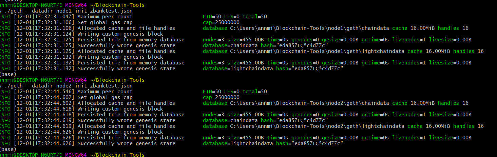
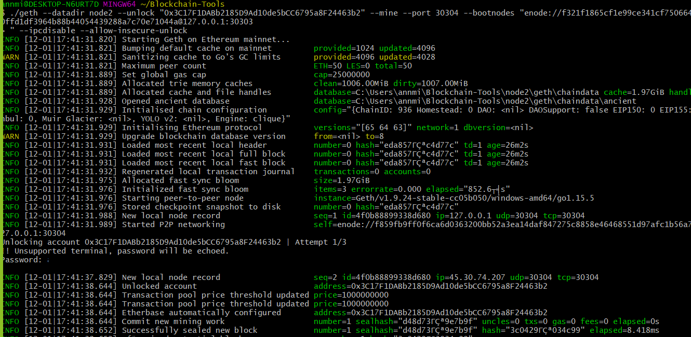
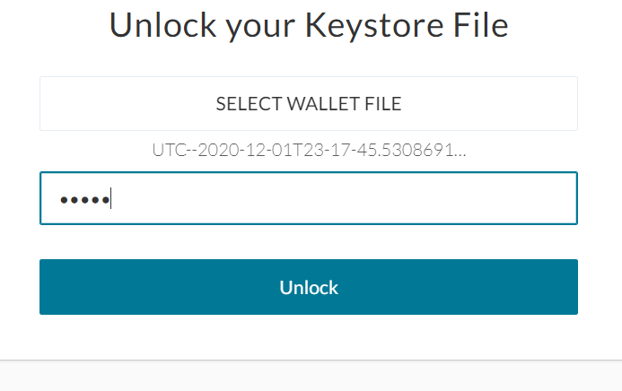
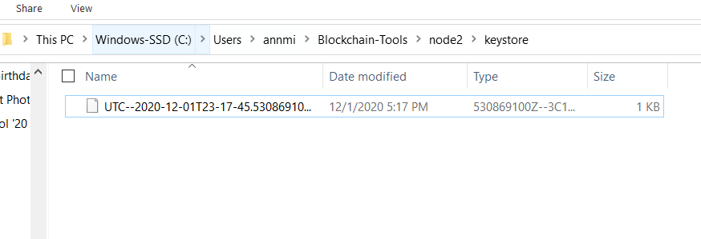
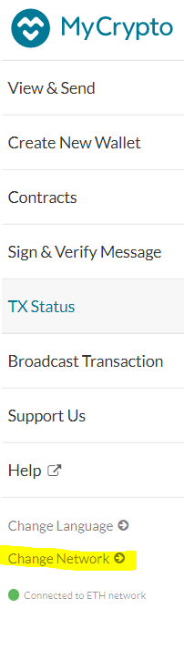
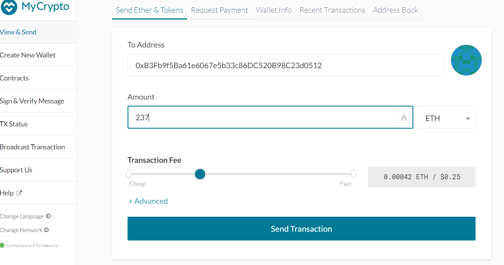
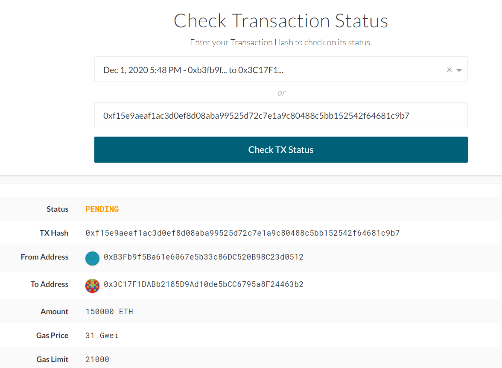

# ZBank-Test
Blockchain Test Network

The following is a description of how to initialize and use the testnet created to explore the potential of use of blockchain at ZBank.

The testnet will allow the development team the freedom to experiment with blockchain offline. *Please Note - the testnet tokens have no real value.* 

The consensus algorithm used to develop the test network was Proof of Authority. Proof of Authority is a centralized system that allows only specific addresses to mine/produce blocks.

## Dependencies Required
> Go Ethereum

> puppeth

> Geth

> MyCrypto

## Environment Setup
For Windows users you will need to download Go Ethereum. Navigate to the Go Ethereum Tools download page at https://geth.ethereum.org/downloads/. The version you download depends on if you're running 32 bit or 64 bit windows. Make sure you select Geth & Tools.

Installing in OS X requires you click on the "Geth & Tools 1.9.7" to download the applications bundle archive.

After downloading the tools archive, you will locate a file named geth-alltools-darwin-amd64-1.9.7-a718daa6.tar.gz in OS X, and a file called geth-alltools-windows-amd64-1.9.7-a718daa6.zip in Windows. Move the file to your base environment and rename 'Blockchain-Tools'.

Scroll down to the "Stable Releases" section and proceed depending on your operating system.

**Note - for Windows users to use Go Ethereum, you must use git-bash as the terminal window to execute commands**

## MyCrypto Set Up
MyCrypto is a free, open-source interface for interacting with the block chain. The application download is located at https://download.mycrypto.com/.
You will be redirected to the appropriate application installer for your operating system. If you are not redirected, choose the appropriate installer.

Open the file, and follow instructions in the installation Wizard.

For OS X users the first time you execute MyCrypto you will see a warning message. click 'Open' to start he application.

If you need to add the application as an exception to your Mac OS security, perform the following:

1. Open the MyCrypto app, it should produce a warning error saying that you cannot open the application due to security reasons. Therefore, we'll need to make a security exception for it.

2. Look to the top-left of the screen and click on the Apple Logo and navigate to System Preferences > Security & Privacy.

## Configuring the Network
1. From the directory, download the zbanktest.json file, and the node1 and node2 folders into your Blockchain-Tools folder. You  are now ready to configure the network.

2. Open your terminal window and cd into Blockchain-Tools.

3. You will now initialize your nodes. Initialize node1 by entering the following. From the data in gitbash, copy your enode to a notebook. You will use it to activate the nodes shortly.

        ./geth init zbanktest.json --datadir node1

4. After, you will initialize node2 by entering the following:

        ./geth init zbanktest.json --datadir node2

5. Now you will activate your nodes. Activate node1 by entering the following:

        ./geth --datadir node1 --unlock "0xB3Fb9f5Ba61e6067e5b33c86DC520B98C23d0512" --mine --rpc --allow-insecure-unlock

6. To initialize node2, you need to open a new terminal window. Copy your enode into the following command and enter it.

        ./geth --datadir node2 --unlock "0x3C17F1DABb2185D9Ad10de5bCC6795a8F24463b2" --mine --port 30304 --bootnodes "enode://YOURENODEHERE@127.0.0.1:30303" --ipcdisable --allow-insecure-unlock

Your blockchain is now activated! You will see data similar to the following in your terminal. 
Things to know:

> Blocktime

    The blocktime is set to the default which is 15 seconds.

> Chain ID

    The chain ID is 936. This protects transactions included in one chain from being included in another. 

> Account Passwords

    Because this is a test network, the password used for keystore files for both nodes is 'admin'.

## Connecting to MyCrypto
You will use the keystore file for the testnet to login to MyCrypto. 

A keystore is a file where private keys, certificates, etc. can be stored and is used to identify the user. It is located in the Blockchain-Tools file. In MyCrypto:
1. Select 'Unlock your Keystore File'
2. Navigate to the Blockchain-Test folder. 
3. Select the node you want to test send a transaction from, and open the keystore file. Enter the node password. You are now ready to set up your network in MyCrypto.

You can send a transaction from either node. The 'to' address will be the node you don't use at this time.

To set up your network:

1. Navigate to 'Change Network' at the bottom of the left panel. 

    

2. Scroll to the bottom of the panel and select '+Add Custom Node'
3. Enter 'zbanktest' as your Node Name.
4. In the Network field, change the dropdown from ETH and scroll to the bottom of the menu to 'Custom'.
5. Enter 'zbanktest' in Network Name field.
6. Select 'ETH' as the currency.
7. Enter 936 as the chain ID.
8. Enter http://127.0.0.1:8545 in the URL field
9. Hit 'Save & Use Custom Node'

You are now ready to Send/Receive test coins.

## Sending a transaction in MyCrypto
To test sending and receiving Ethereum in MyCrypto:

1. Log-in with the Keystore file (which contains your private key) and password.
2. Under Select choose 'Send Ether and Tokens'
    
3. Enter the address you want to send coins to (the opposite of the node you used to login).
4. Check your balance. Enter the amount of Ethereum, and the fee you want to pay to send. 
5. At the bottom of the page, you will see a link to check your transaction status and metadata that shows ETH, address, and fee information. 

    

**To STOP the block chain hit CTRL + C in the terminal (once for each node) and the blockchain will deactivate.**

## Next Steps
Once the network has been sufficiently tested, the next step would be to test using the Proof of Work consensus algorithm. Proof of work is the most popular algorithm that uses real computing power and energy to blocks. It is decentralized, and highly secure, but also more expensive in terms of resources.

